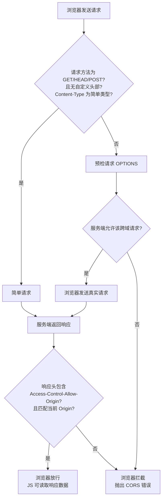

# 跨域解决方案

跨域是前端开发中常见的问题，需要理解同源策略和解决方案。

## 什么是跨域？

浏览器的**同源策略**（Same-Origin Policy）限制了一个源（origin）的文档或脚本如何与另一个源的资源进行交互。

**同源的定义**：协议、域名、端口都相同。

## CORS（跨域资源共享）

```http
# 简单请求
GET /data HTTP/1.1
Host: api.example.com
Origin: https://example.com

HTTP/1.1 200 OK
Access-Control-Allow-Origin: https://example.com
Access-Control-Allow-Methods: GET, POST
Access-Control-Allow-Headers: Content-Type

# 预检请求（非简单请求）
OPTIONS /data HTTP/1.1
Host: api.example.com
Origin: https://example.com
Access-Control-Request-Method: POST
Access-Control-Request-Headers: X-Custom-Header

HTTP/1.1 204 No Content
Access-Control-Allow-Origin: https://example.com
Access-Control-Allow-Methods: POST
Access-Control-Allow-Headers: X-Custom-Header
```

### CORS 核心流程图



**流程说明：**

1. **判断请求类型**：浏览器先检查请求是否满足简单请求条件
2. **简单请求**：直接发送真实请求，携带 `Origin` 头部
3. **预检请求**：不满足简单请求条件时，先发送 `OPTIONS` 预检请求，携带 `Access-Control-Request-Method` 和 `Access-Control-Request-Headers`
4. **服务端响应**：返回对应的 `Access-Control-Allow-*` 响应头
5. **浏览器校验**：检查响应头是否允许当前源的访问，允许则放行，否则拦截

## CORS 服务端配置示例

### 1. Node.js / Express

```js
const express = require('express');
const app = express();

// 方式一：手动设置响应头
app.use((req, res, next) => {
  res.setHeader('Access-Control-Allow-Origin', 'https://example.com');
  res.setHeader('Access-Control-Allow-Methods', 'GET, POST, PUT, DELETE');
  res.setHeader('Access-Control-Allow-Headers', 'Content-Type, Authorization');
  res.setHeader('Access-Control-Allow-Credentials', 'true');
  res.setHeader('Access-Control-Max-Age', '86400');

  // 处理预检请求
  if (req.method === 'OPTIONS') {
    res.sendStatus(204);
    return;
  }
  next();
});

// 方式二：使用 cors 中间件
const cors = require('cors');
app.use(cors({
  origin: 'https://example.com',      // 允许的源
  methods: ['GET', 'POST', 'PUT', 'DELETE'],
  allowedHeaders: ['Content-Type', 'Authorization'],
  credentials: true,                  // 允许携带 Cookie
  maxAge: 86400                       // 预检缓存 24 小时
}));
```

### 2. Node.js / Koa

```js
const Koa = require('koa');
const app = new Koa();

app.use(async (ctx, next) => {
  ctx.set('Access-Control-Allow-Origin', 'https://example.com');
  ctx.set('Access-Control-Allow-Methods', 'GET, POST, PUT, DELETE');
  ctx.set('Access-Control-Allow-Headers', 'Content-Type, Authorization');
  ctx.set('Access-Control-Allow-Credentials', 'true');

  if (ctx.method === 'OPTIONS') {
    ctx.status = 204;
    return;
  }
  await next();
});
```

### 3. Nginx

```nginx
server {
  listen 80;
  server_name api.example.com;

  location / {
    # 允许跨域的源
    add_header 'Access-Control-Allow-Origin' 'https://example.com' always;
    add_header 'Access-Control-Allow-Methods' 'GET, POST, PUT, DELETE, OPTIONS' always;
    add_header 'Access-Control-Allow-Headers' 'Content-Type, Authorization' always;
    add_header 'Access-Control-Allow-Credentials' 'true' always;
    add_header 'Access-Control-Max-Age' '86400' always;

    # 处理预检请求
    if ($request_method = 'OPTIONS') {
      return 204;
    }

    proxy_pass http://backend;
  }
}
```

### 4. Spring Boot

```java
// 方式一：Controller 级别注解
@RestController
@CrossOrigin(
  origins = "https://example.com",
  methods = {RequestMethod.GET, RequestMethod.POST},
  allowedHeaders = "*",
  allowCredentials = "true",
  maxAge = 3600
)
public class UserController { }

// 方式二：全局配置
@Configuration
public class CorsConfig implements WebMvcConfigurer {
  @Override
  public void addCorsMappings(CorsRegistry registry) {
    registry.addMapping("/**")
      .allowedOrigins("https://example.com")
      .allowedMethods("GET", "POST", "PUT", "DELETE")
      .allowedHeaders("*")
      .allowCredentials(true)
      .maxAge(3600);
  }
}

// 方式三：CorsFilter 全局过滤器
@Bean
public CorsFilter corsFilter() {
  CorsConfiguration config = new CorsConfiguration();
  config.addAllowedOrigin("https://example.com");
  config.addAllowedMethod("*");
  config.addAllowedHeader("*");
  config.setAllowCredentials(true);

  UrlBasedCorsConfigurationSource source = new UrlBasedCorsConfigurationSource();
  source.registerCorsConfiguration("/**", config);

  return new CorsFilter(source);
}
```

> **注意**：当 `allowCredentials = true` 时，`allowedOrigins` 不能为 `*`，必须指定具体域名。

## 其他跨域方案

### 1. JSONP（只支持 GET）

```js
function handleResponse(data) {
  console.log(data);
}
const script = document.createElement('script');
script.src = 'https://api.example.com/data?callback=handleResponse';
document.body.appendChild(script);
```

### 2. 代理服务器（开发环境）

```js
// vite.config.js
export default {
  server: {
    proxy: {
      '/api': {
        target: 'https://api.example.com',
        changeOrigin: true
      }
    }
  }
};
```

### 3. postMessage（窗口间通信）

```js
// 父窗口
window.addEventListener('message', (event) => {
  if (event.origin !== 'https://trusted.com') return;
  console.log(event.data);
});

// 子窗口
window.parent.postMessage('Hello', 'https://parent.com');
```

| 方案 | 支持方法 | 适用场景 |
|------|----------|----------|
| CORS | 所有 | 现代浏览器推荐方案 |
| JSONP | 仅 GET | 老旧浏览器兼容 |
| 代理 | 所有 | 开发环境、服务端 |
| postMessage | - | iframe 间通信 |

### 高频面试题

**Q: 什么是同源策略？跨域解决方案有哪些？**

**答案**：
- **同源策略**：协议、域名、端口都相同的策略
- **解决方案**：
  - CORS（推荐）：服务端设置 Access-Control-* 头部
  - JSONP：仅支持 GET，利用 script 标签
  - 代理服务器：开发环境或生产环境转发请求
  - postMessage：iframe 窗口间通信
