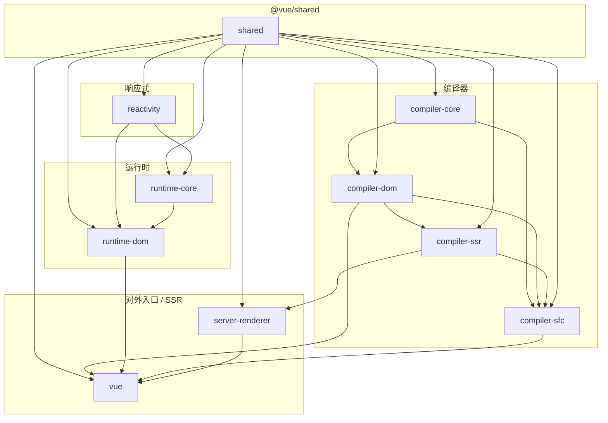
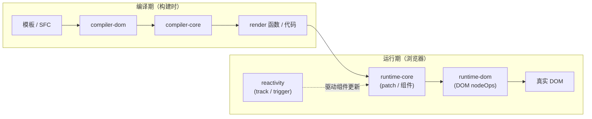
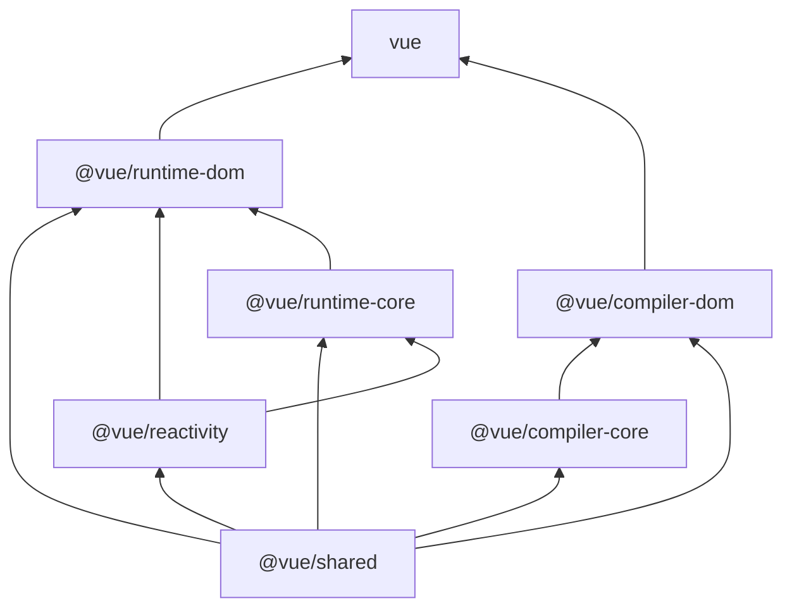
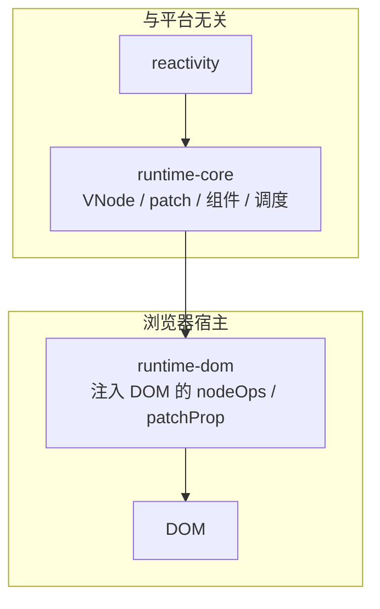

### `reactivity`
- **输入**：原始数据（对象、原始值）、副作用注册（如 `effect`）、可选的配置（调度器等）。
- **输出**：响应式代理（`reactive`/`readonly` 等）、`ref` 包装、依赖收集与触发（`track`/`trigger`）及其之上的 API（`computed`、`watch` 等）。
- **与谁协作**：被 `@vue/runtime-core` 用来驱动组件渲染与更新的订阅关系；依赖 `@vue/shared` 工具；**不依赖** DOM 或编译器。

### `runtime-core`
- **输入**：与平台无关的「节点」抽象（通过可注入的 `nodeOps`）、`VNode` 树、组件状态与生命周期钩子、调度策略。
- **输出**：通用渲染器（`createRenderer`）、组件实例模型、`patch` 与调度核心、与 DOM 无关的指令/组件运行时逻辑。
- **与谁协作**：依赖 `@vue/reactivity`、`@vue/shared`；向上由 `@vue/runtime-dom`（或其它运行时如 test/ssr）注入真实平台的节点操作；编译产物中的 `render` 函数在此层执行并产出 VNode。

### `runtime-dom`
- **输入**：浏览器环境下的 DOM API 假设（元素、文本、属性、事件）、可选的水合（hydration）等 Web 特性。
- **输出**：面向浏览器的默认渲染器与 `createApp`、DOM 专属的 patch 细节（如属性/prop/事件处理）、部分仅浏览器有意义的运行时能力入口。
- **与谁协作**：依赖并扩展 `@vue/runtime-core`；与 `@vue/compiler-dom` 生成的代码、运行时 helper 对齐；作为 `vue` 包在浏览器场景下的运行时底座。

### `compiler-core`
- **输入**：源码字符串或 AST、编译选项、可扩展的转换插件（transform pipeline）。
- **输出**：与宿主无关的核心 AST 变换与代码生成框架、中间表示；面向「任意宿主」的可插拔编译管线（不限于 HTML）。
- **与谁协作**：依赖 `@vue/shared`；被 `@vue/compiler-dom`、`@vue/compiler-sfc` 等在之上追加宿主语法（HTML、SFC 块等）；**不执行** 生成代码，也不触碰 DOM。

### `compiler-dom`
- **输入**：含 DOM/HTML 语法的模板（或经 SFC 解析后的 template 片段）、DOM 相关编译选项。
- **输出**：面向 DOM 运行时的编译结果（例如带 `h`/运行时 helper 调用的渲染函数或代码字符串），与浏览器端 vnode 语义一致。
- **与谁协作**：依赖并调用 `@vue/compiler-core`；产物供 bundler + `vue` 与 `@vue/runtime-dom` 在浏览器中配合使用。

### `vue`
- **输入**：应用侧对框架 API 的使用方式、构建工具对 entry 的选择（仅 runtime / 带编译器的完整版等）。
- **输出**：对外统一的 `vue` 发行包与类型定义；聚合运行时、DOM 编译、SFC、SSR 等子路径导出（如 `vue/compiler-sfc`、`server-renderer`）。
- **与谁协作**：依赖 `@vue/runtime-dom`、`@vue/compiler-dom`、`@vue/compiler-sfc`、`@vue/server-renderer`、`@vue/shared` 等，是**终端开发者看到的单一入口**。

## `runtime-core` 与 `runtime-dom`
- **runtime-core**：定义「如何对比两棵 VNode 树并调用抽象的节点 API」——组件、调度、`patch` 主流程都在这里；平台只是一组可替换的 `nodeOps` / `patchProp`（也可以是字符串化测试里的假节点）。
- **runtime-dom**：把上述抽象**落到真实 DOM**——如何创建/插入元素、如何处理 DOM 属性与事件、如何利用浏览器特有行为（与水合、部分模块能力等相关）。
- **一句话**：core 负责「Vue 组件与更新算法」，dom 负责「这些算法在浏览器里具体怎么动 DOM」。

## 依赖关系

### 主要 workspace 包依赖

### 编译期 vs 运行期（数据/职责流）

###  六个核心包 + shared

如需把 runtime-core 与 runtime-dom 边界单独成一张，可以用「分层」图

